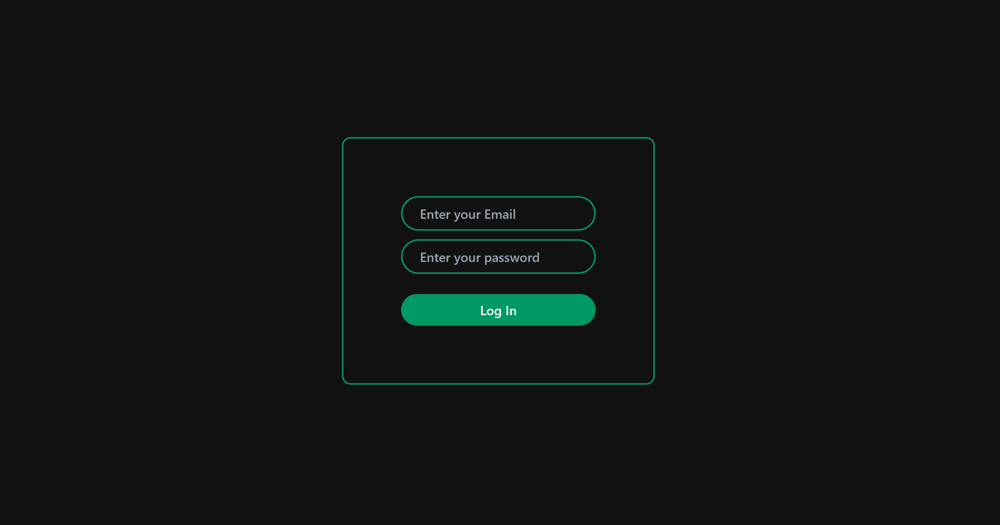
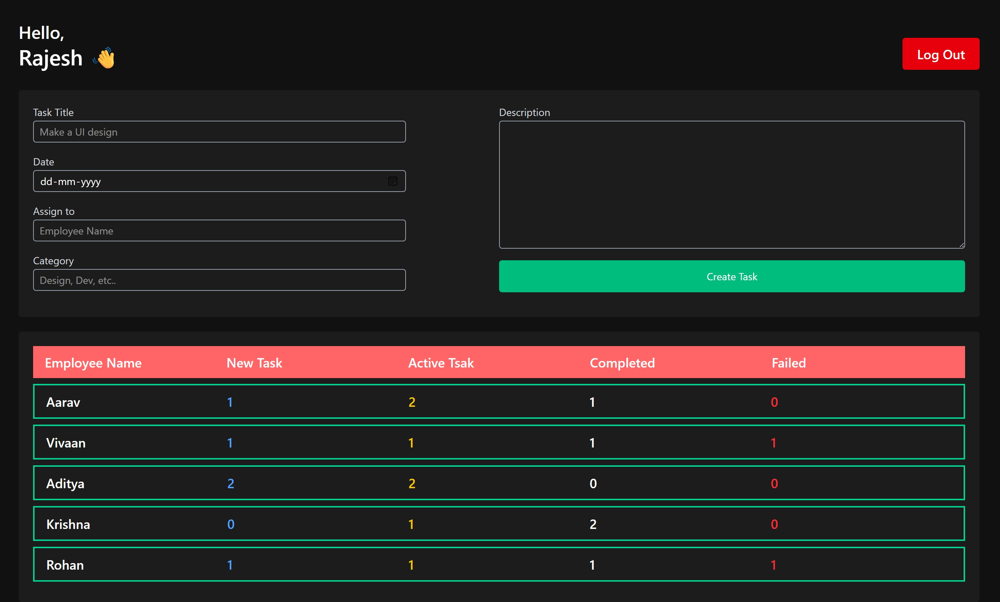
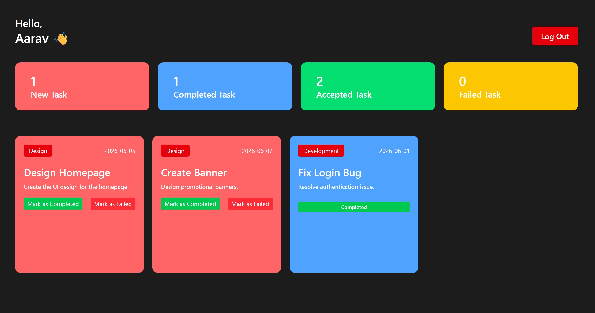

# Employee Management System

A modern Employee Management System built using React.js and Tailwind CSS featuring role-based authentication, task management dashboards, and responsive UI.

---

## Live Demo

🔗 [View Live Project]
https://employee-management-system-geyd4gmky-kushal-react-s-projects.vercel.app/

---

## Features

* Admin Dashboard
* Employee Dashboard
* Role-based Authentication
* Task Assignment System
* Task Status Tracking
* Dynamic Dashboard Statistics
* Responsive UI
* Local Storage Persistence

---

## Tech Stack

* React.js
* Vite
* Tailwind CSS
* JavaScript
* Local Storage

---

## Demo Credentials

### Admin Login

Email:
[admin@me.com](mailto:admin@me.com)

Password:
123

---

### Employee Logins

#### Aarav

Email: [employee1@example.com](mailto:employee1@example.com)

Password: 123

#### Vivaan

Email: [employee2@example.com](mailto:employee2@example.com)

Password: 123

#### Aditya

Email: [employee3@example.com](mailto:employee3@example.com)

Password: 123

#### Krishna

Email: [employee4@example.com](mailto:employee4@example.com)

Password: 123

#### Rohan

Email: [employee5@example.com](mailto:employee5@example.com)

Password: 123

---

## Screenshots

### Login Page



---

### Admin Dashboard



---

### Employee Dashboard



---

## Folder Structure

```bash
src/
 ├── components
 ├── context
 ├── assets
 ├── pages
 ├── utils
 └── App.jsx
```

---

## Future Improvements

* Backend Integration
* MongoDB Database
* JWT Authentication
* Real-time Task Updates
* Task Filtering & Search
* User Profile Management

---

## Author

Kushal Bajaj
